# CarthVillage

> CarthVillage is the unified platform for Carthage University, designed to bring universities together as a village while keeping the environment green. It combines academic management, data intelligence, AI-enabled reporting, and campus services into one cohesive experience.


## Project Overview

CarthVillage is a unified academic platform for Carthage University, created to bring universities together as a village while preserving a green campus environment.

The platform combines intelligent university operations, collaborative data services, and sustainable campus planning through a cohesive modern stack.

- Python backend with FastAPI, Supabase, AI orchestration, and extensible service workflows.
- React frontend built with Vite and TypeScript for responsive dashboards and campus interactions.
- Embedded agents, analytics, and document ingestion to turn university data into actionable insight.
- Intelligence features that include predictive forecasting, automated report generation, natural language query support, and AI-guided campus operations.

This repository contains the full CarthVillage platform, the presentation PDF, exported presentation page images, and the overview video.

## Video Showcase


## Presentation Assets

The Carthage platform presentation is available in the repository as [Carthage-Platform-presentation.pdf](./Carthage-Platform-presentation.pdf). The presentation pages have also been exported into image assets in `documentation/images` and appear below.

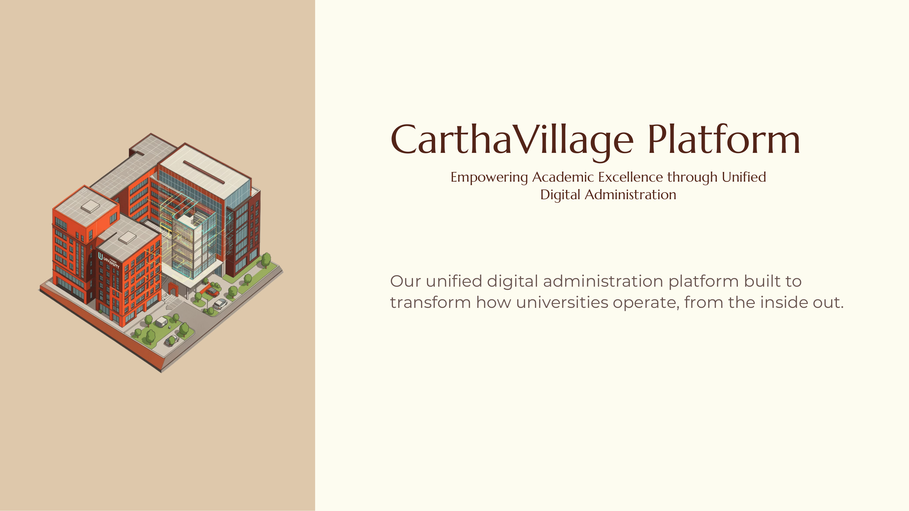

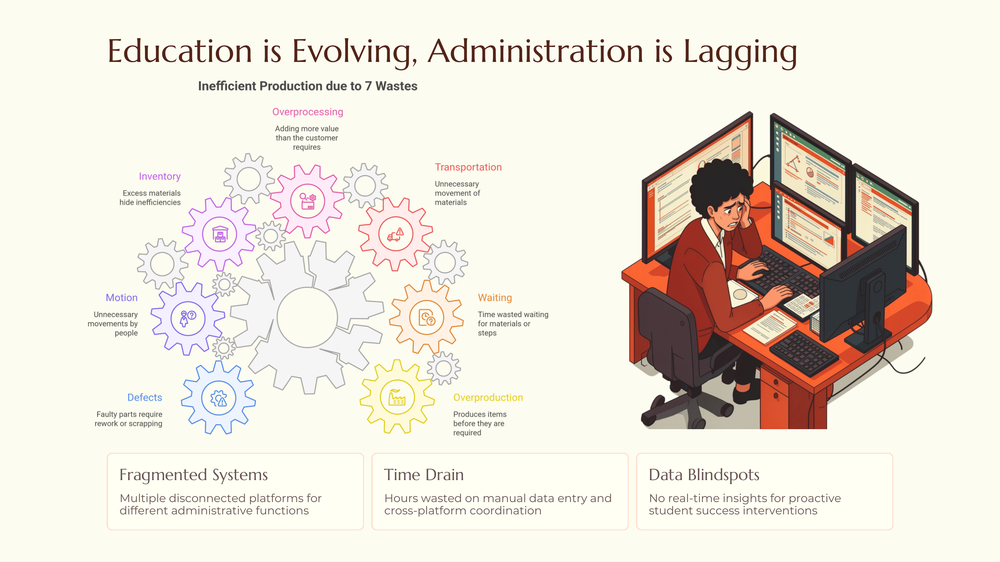

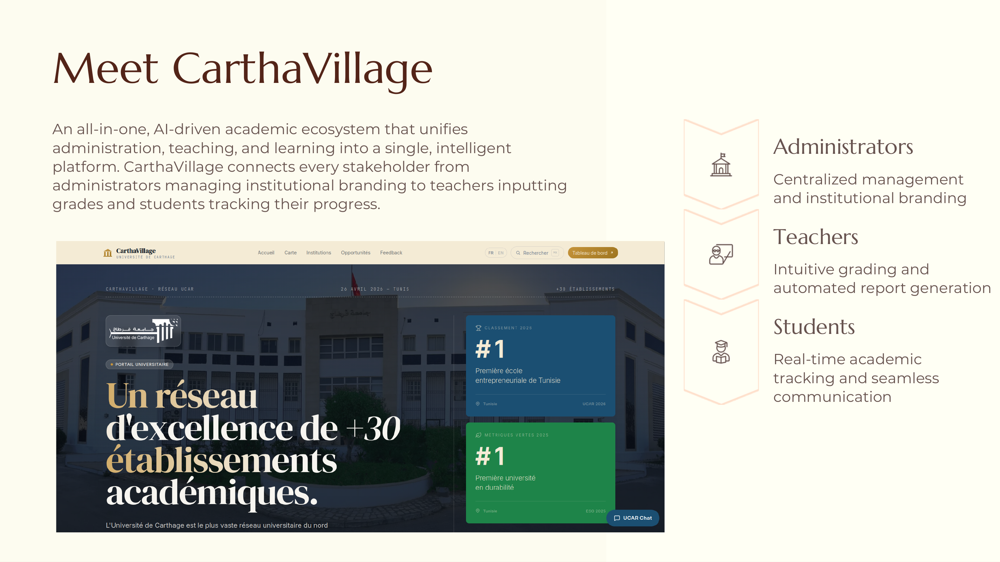

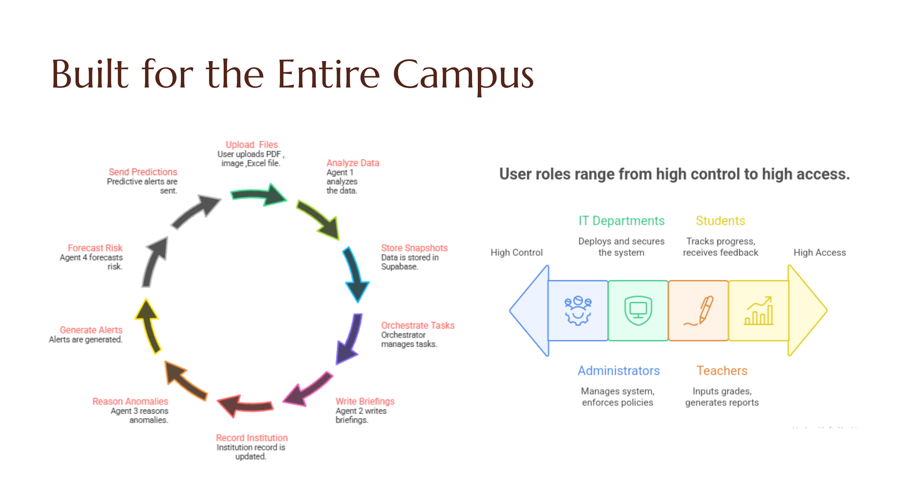

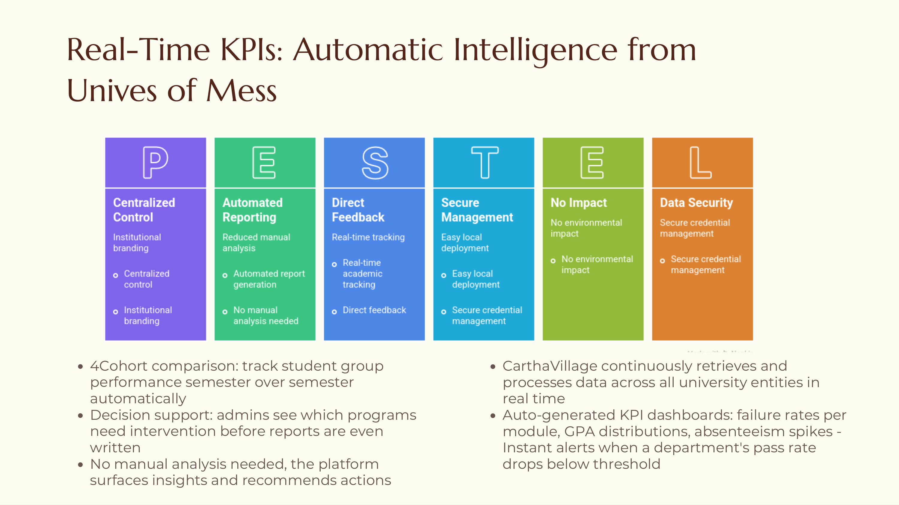

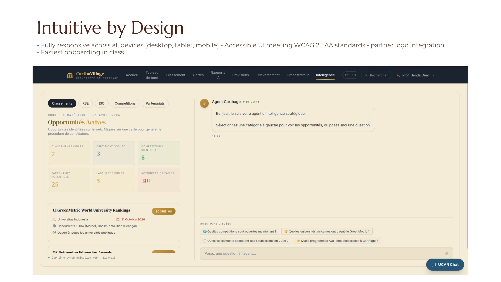

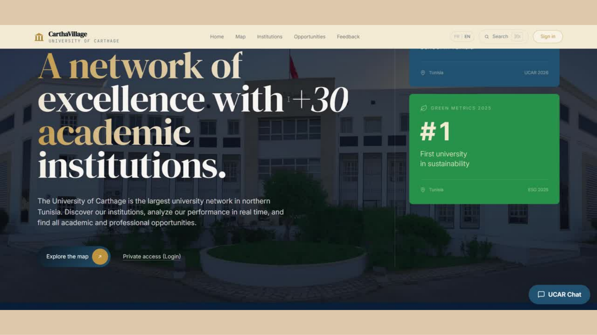

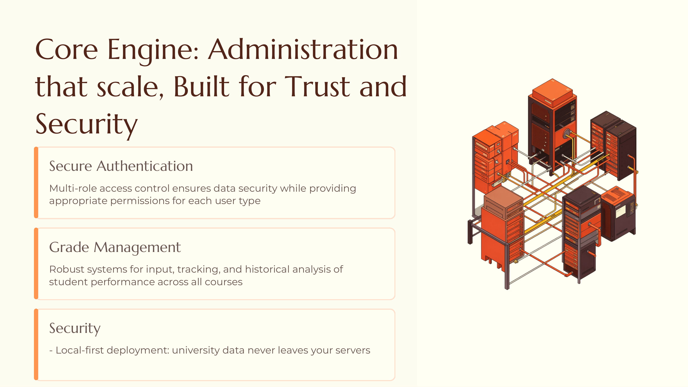

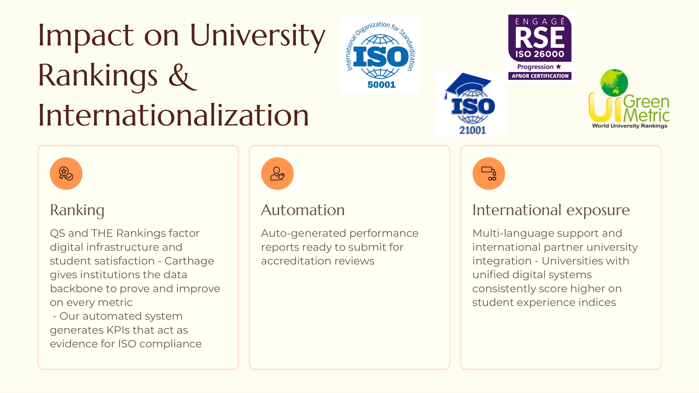

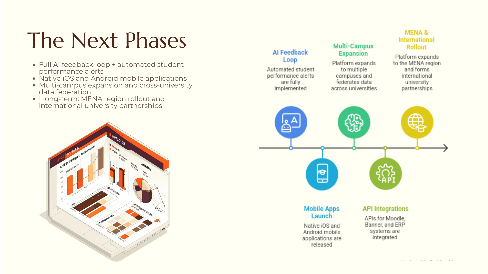

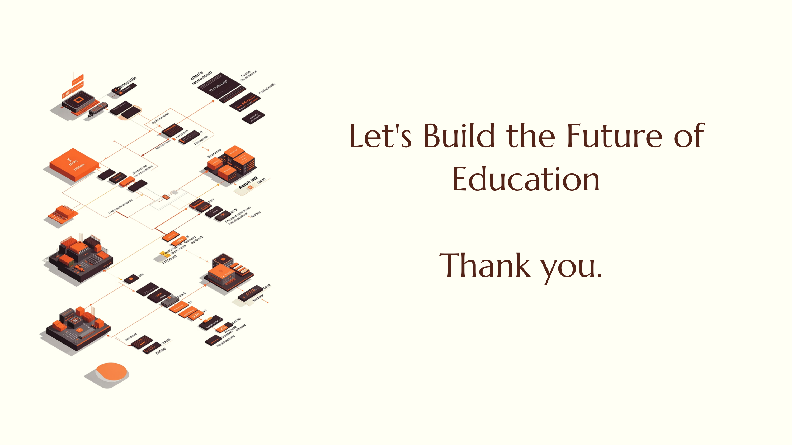

## Key Features

- Unified university data catalog, reporting, and academic intelligence.
- AI-driven assistants for analytics, forecasting, automated reporting, and decision support.
- Opportunities finder for uncovering new programs, partnerships, and resource optimizations across the campus village.
- Intelligent workflows that convert documents, policies, and campus data into searchable knowledge.
- Natural language query capability for staff to ask questions and get actionable insights.
- Predictive forecasting for enrollment, resource planning, and sustainability metrics.
- Real-time dashboards and collaborative interfaces for academic staff and administrators.
- Supabase-backed user management, secure access, and extensible workflow integration.
- Designed around sustainable campus operations and cross-university collaboration.

## Architecture

- `backend/` contains the FastAPI server, database models, schemas, services, and AI orchestration.
- `frontend/` contains the React + Vite application used for the user experience.
- Presentation assets are stored in `documentation/images`.

## Getting Started

### Backend

The backend uses `uv` as the Python process manager.

```bash
cd backend
uv run uvicorn main:app --reload
```

### Frontend

```bash
cd frontend
npm install
npm run dev
```

## Project Structure

- `backend/`
  - `main.py` - FastAPI application entry point.
  - `core/` - configuration, database, security, and utilities.
  - `api/` - API routes and ingest endpoints.
  - `models/` - database model definitions.
  - `schemas/` - request/response schemas.
  - `services/` - business logic, ingestion, and AI engines.
  - `workers/` - background task processing.

- `frontend/`
  - `src/` - React application source.
  - `package.json` - frontend dependencies and scripts.
  - `vite.config.ts` - Vite configuration.

- `documentation/images/` - exported presentation page images.
- `Carthage-Platform.mp4` - platform video presentation.

## Notes

The current repository is named CarthVillage to reflect the vision of a unified campus ecosystem. The platform is designed to connect universities and academic communities through shared resources, intelligent insights, and eco-friendly operations.

For more detail on the platform vision, review the presentation images in `documentation/images` and play `Carthage-Platform.mp4`.
